<table class="sphinxhide" width="100%">
 <tr width="100%">
    <td align="center"><h1>Wrapping your Custom IP with AXI Packaging and Linux Driver Tutorial</h1>
    </td>
 </tr>
</table>

# AXI IP Packaging

This section of the tutorial covers the essential steps to package an AXI IP using the AMD Vivado&trade; Design Suite.

## Outline

1. [Introduction](#introduction)
    1. [The AXI Protocol](#the-axi-protocol)
    2. [The Basics of an IP](#the-basics-of-an-ip)
2. [Using Vivado to Package your Custom IP](#using-vivado-to-package-your-custom-ip)
    1. [Creating an IP project with the Vivado IP Packager](#1-creating-an-ip-project-with-the-vivado-ip-packager)
    2. [Editing the IP HDL](#2-editing-the-ip-hdl)
    3. [Editing the IP Package](#3-editing-the-ip-package)
3. [Encrypting your IP](#encrypting-your-ip)

## Introduction

### The AXI Protocol

The Advanced eXtensible Interface (AXI) protocol for Intellectual Property (IP) cores defined an on-chip communication bus protocol to standardize how information between AXI master and AXI slave is exchanged. An IP can be both a slave and a master depending on the intended application. A processor can also have AXI interfaces; therefore, IPs and processors can exchange information through the AXI protocol. AXI is part of the Arm Advanced Microcontroller Bus Architecture (AMBA), and it defines an on-chip interconnect specification for blocks in a system-on-chip circuit.

AMD-Xilinx has introduced this interfaces in 2010 to its design tools based on the AMBA 4.0 release. Since then, AXI has been widely adopted in AMD-Xilinx product offerings. There are three AXI4 interfaces defined:

+ **AXI4**: For high-performance memory-mapped requirements.
+ **AXI4-Lite**: For simple, low-throughput memory-mapped communication.
+ **AXI4-Stream:** For high-speed streaming data.

The benefits of the AXI protocol are:

+ **Productivity**: By standardizing on the AXI interface, developers only need to learn a single protocol for IP.
+ **Flexibility**: Providing the right protocol for the application:

  + AXI4 is for memory-mapped interfaces and allows high throughput bursts of up to 256 data transfer cycles with just a single address phase.
    + AXI4-Lite is a light-weight, single transaction memory-mapped interface.
    + AXI4-Stream removes the requirement for an address phase altogether and allows unlimited data burst size.
+ **Availability**: By moving to an industry-standard, you have access not only to the Vivado IP Catalog, but also to a worldwide community of Arm partners.

The AXI protocol describes five independent channels, each with its own handshaking signals:

+ Read Address Channel
+ Write Address Channel
+ Read Data Channel
+ Write Data Channel
+ Write Response Channel

The following figure shows an AXI4 read transaction.  
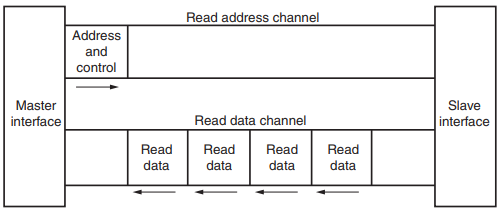

The following figure shows an AXI4 write transaction .
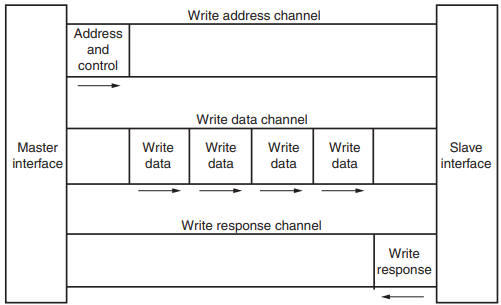

For more information about the AXI protocol, refer to the *AXI Reference Guide* [(UG1037)](https://docs.amd.com/v/u/en-US/ug1037-vivado-axi-reference-guide).

### The Basics of an IP

IP is a key component in the design of system-on-chip (SoC) hardware, particularly when it comes to design building blocks. Design building blocks represent predesigned, reusable portions of an SoC that can be integrated into a larger architecture, streamlining the development process, minimizing cost, and reducing time-to-market. These building blocks form the intellectual property that underpins the SoC design, encompassing elements such as functional units, logic circuits, and customized processor cores.

IP building blocks enable companies to focus on innovation, as reuse of proven design components eliminates the need to "reinvent the wheel" for every new project. By using preverified IP design building blocks, SoC designers benefit from reduced design risk and improved reliability of the final product, perpetually accelerating innovation within the industry. Protection of these design building blocks is essential for companies to maintain a competitive edge and ensure that their contributions to the field are properly recognized and rewarded.

Companies can choose to license their design building blocks to other businesses, allowing them to leverage the technology for specific purposes and under predefined terms. This licensing system enables both the sharing of innovations and the protection of competitive advantages, providing a balanced approach to intellectual property management.

An important aspect of utilizing IP design building blocks in a system-on-chip (SoC) design is ensuring seamless communication between different IPs and the system bus. In the context of AMD FPGA and SoCs, the AXI serves as the industry-standard protocol that facilitates interconnection among various IPs. The Vivado Design Suite provides a user-friendly approach by employing AXI wrappers to achieve compatibility and smooth communication among IP cores.

An AXI wrapper essentially encapsulates the IP core and provides AXI-compliant interfaces to communicate with other IP cores and the system bus in a SoC design. Using Vivado, designers can take advantage of built-in tools, such as the IP integrator, that enables the creation or modification of AXI wrappers, guaranteeing consistent and efficient IP core integration. You can either choose from a selection of existing AXI wrappers for standard IP blocks or create custom AXI wrappers tailored to your IP's unique requirements.

The IP packager in Vivado further enhances the usability of design building blocks in SoC projects by delivering supplementary files alongside the encapsulated core. These additional files, which include simulation files, driver files, constraint files, among others, provide designers with an all-inclusive package that mitigates integration challenges in the development process. For instance, simulation files enable designers to validate and refine the IP's performance before integration, while driver files contain necessary software components that ensure proper functioning and interface with the system. Constraint files, on the other hand, allow designers to specify and manage essential parameters such as pin assignments, voltage levels, and clock requirements.

For more details about IP cores, refer to:

+ *Vivado Design Suite User Guide: Designing with IP* [(UG896)](https://docs.amd.com/r/en-US/ug896-vivado-ip)
+ *Vivado Design Suite User Guide: Designing IP Subsystems Using IP Integrator* [(UG994)](https://docs.amd.com/r/en-US/ug994-vivado-ip-subsystems)
+ *Vivado Design Suite User Guide: Creating and Packaging Custom IP* [(UG1118)](https://docs.amd.com/r/en-US/ug1118-vivado-creating-packaging-custom-ip)

## Using Vivado to Package your Custom IP

For this tutorial, the 1-Wire core will be used to demonstrate how a custom hardware core can be packaged into an AXI IP. The hardware description language used is Verilog, but other language such as VHDL can also be used. All the required files are provided for the tutorial within the [reference_files](./reference_files/) folder. The structure is:

```
AXI-packaging-and-Linux-driver/reference_files
├── application
|   ├── application_bm.c
|   └── application_bm.h
├── baremetal_driver
|   ├── data
|   |   ├── axi_1wire_host.mdd
|   |   ├── axi_1wire_host.tcl
|   |   └── axi_1wire_host.yaml
|   └── src
|       ├── axi_1wire_host_selftest.c
|       ├── axi_1wire_host.c
|       ├── axi_1wire_host.h
|       ├── CMakeLists.txt
|       └── Makefile
├── constraints
|   └── axi_1wire_host.xdc
├── hdl
|   ├── axi_1wire_host_slave_lite_v1_2_S00_AXI.v
│   ├── axi_1wire_host.v
│   ├── clk_div.v
│   ├── jcnt.v
│   ├── sr.v
│   └── w1_master.v
└──  linux_driver
    ├── amd_axi_w1.c
    ├── w1chardev.c
    └── xlnxw1-app.c
```

Throughout the tutorial the *AXI-packaging-and-Linux-driver/* folder will be referenced as *<working_directory>*.
> **NOTE:**  *clk_div.v*, *jcnt.v*, and *sr.v* are encrypted files; knowing how they are implemented is not needed for the tutorial as they are only subcores within the main 1-Wire core.

### 1. Creating an IP project with the Vivado IP Packager

Assume that you have an existing piece of hardware ready to be wrapped into an AXI wrapper, and use the 1-Wire host to go through the process.

1. Source the Vivado installation, usually using a command similar to ```source /opt/Xilinx/Vivado/2024.2/settings64.sh```. Then, to launch the Vivado GUI, enter ```vivado```.

2. Create a new project with the following settings:
    + Project Name
        + Project Name: *myproject*
        + Project Location: *<working_directory>*
        + Create project subdirectory: *checked*
    + Project Type
        + Project Type: *RTL Project*
        + Do not specify sources at this time: *unchecked*
        + Project is an extensible Vitis Platform: *unchecked*
    + Add Sources
        + *<working_directory>/reference_files/hdl/jcnt.v*
        + *<working_directory>/reference_files/hdl/sr.v*
        + *<working_directory>/reference_files/hdl/w1_master.v*
        + Scan and add RTL include file into project: *checked*
        + Copy sources into project: *checked*
        + Target language: *Verilog*
        + Simulator language: *Mixed*
    + Default Part
        + Board: *Kria KD240 Drives Starter Kit SOM*
            + Add Companion Card Connections:
                + Connector 1 on K24 SOM (SOM240_1): *Drives Starter Kit carrier(SOM240_1)*
                + Connector 2 on K24 SOM (SOM40_2): *Drives Starter Kit carrier(SOM40_2)*
    > **NOTE:** As previously mentioned, *clk_div.v*, *jcnt.v*, and *sr.v* are encrypted files. From a high level functionality, here is what each module is implementing:
    > + *clk_div.v*: Implement a clock divider to reduce the frequency of a input clock.
    > + *jcnt.v*: Implement a Johnson counter with asynchronous reset.
    > + *sr.v*: Implement a circular shift register with asynchronous reset.

    At this point, your hardware core is ready for packaging.

    For more information on the Vivado IDE, refer to:

    + *Vivado Design Suite User Guide: Using the Vivado IDE* [(UG893)](https://docs.amd.com/r/en-US/ug893-vivado-ide)
    + *Vivado Design Suite User Guide: Design Flows Overview* [(UG892)](https://docs.amd.com/r/en-US/ug892-vivado-design-flows-overview)

3. In Vivado, go to *Tools* &rarr; **Create and Package New IP...**
    1. In the new window, click **Next >**.
    2. Select **Create a new AXI4 peripheral**, and click **Next >**.
    3. Input the following in the *Peripheral Details* window:
        + Name: *axi_1wire_host*
        + Version: *0.1*
        + Display name: *AXI 1-Wire Bus Host*
        + Description: *1-Wire AXI IP to demonstrate the IP Packaging*
        + IP location: *<working_directory>/myIP*
        + Overwrite existing: *unchecked*

        Click **Next >**.
    4. In the *Add Interfaces* window, use the following:
        + Enable Interrupt Support: *unchecked*
        + Keep the default setting with 1 interface (*S00_AXI*)
        + Name: *S00_AXI*
        + Interface Type: *Lite*
        + Interface Mode: *Slave*
        + Data Width (Bits): *32*
        + Number of Registers: *8*

        It should look similar to the following screenshot:  
        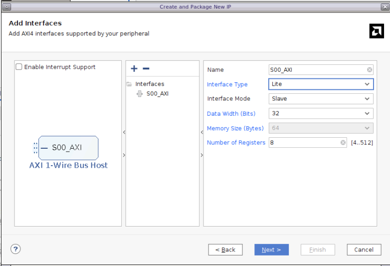
        > **NOTE:** Here you are creating an AXI4 IP with a AXI4-Lite interface in Slave mode. The process for an AXI4 or AXI4-Stream interface in slave or master mode is similar.  
        > To figure out how many registers are needed for your IP, think about what data you need to store, if there is instruction that you need to send to the IP core, interrupt signals to register. The AXI register provides a way for communication between your IP core and other AXI compatible components. Not all signals from your IP core have to be registered in the AXI registers, some can be set as input and/or output of the IP.

        Click **Next >**.

    5. In the last window, before clicking **Finish**, select **Edit IP**.

### 2. Editing the IP HDL

1. Two files are generated by the Vivado IP Packager:
    + *axi_1wire_host_slave_lite_v0_1_S00_AXI.v*: AXI logic and registers for the AXI Bus Interface S00_AXI. This Verilog file is used to implement the AXI registers and the logic to read and write to the registers for the AXI interface you created with the Vivado IP Packager. You would typically instantiate your IP core and other required logic for your IP here.
    + *axi_1wire_host.v*: AXI IP top level wrapper. This Verilog file is used to instantiate each AXI interfaces. Here you are using one AXI interface for your 1-Wire IP.

2. Add the source files to the IP project:
    1. Click **Add Sources** .
    2. Select **Add or create design sources**, and click **Next >**.
    3. Select **Add Files**, navigate to *<working_directory>/myproject/myproject.srcs/sources_1/imports/hdl/*.
    4. Select all three files (*jcnt.v*, *sr.v* and *w1_master.v*), and click **OK**.
    5. Select **Add Files** again, navigate to *<working_directory>/reference_files/hdl*, select **clk_div.v**, and click ***OK**.
    6. Deselect **Scan and add RTL include files into project** and keep **Copy sources into IP Directory** selected.
        > **NOTE**  
        > *clk_div* is not part of the 1-Wire core but is used to create a slower clock to drive the core. The AMD Clocking Wizard IP could have been used if your core clock is in the range of the AMD Clocking Wizard IP, but the 1-Wire protocol required a slower clock than what can be provided, therefore you are using a custom one.  

3. Edit the AXI logic and registers wrapper *axi_1wire_host_slave_lite_v0_1_S00_AXI.v*:
    > *<working_directory>/reference_files/hdl/axi_1wire_host_slave_lite_v1_2_S00_AXI.v* is provided as a reference.
    1. Instantiate the modules
        + Instantiate the clock divider under *// Add user logic here* on line 345.

            ```verilog
            CLK_DIVIDER #(.DIVIDER(CLK_DIV_VAL_TO_1MHz)) CLK_DIVIDER(
                .areset(S_AXI_ARESETN),
                .clk_in(S_AXI_ACLK),
                .clk_out(clk_1MHz)
            );
            ```

        + Instantiate the 1-Wire core after the clock divider.

            ```verilog
            W1_MASTER W1_MASTER(
                .clk_1MHz(clk_1MHz),
                .areset(S_AXI_ARESETN),
                .ctrl_reset(ctrl_reset),
                .go(go),
                .command(command),
                .tx_data(tx_data),
                .from_dq(from_dq),
                .dq_ctrl(dq_ctrl_master),
                .dq_out(dq_out_master),
                .done(done),
                .ready(ready),
                .reg_wr(reg_wr),
                .failure(failure),
                .data_out(rx_data)
            );
            ```

        + The 1-Wire bus is an input/output bus, so an IOBUF is required to control the input/output bus; instantiate it after the 1-Wire core.

            ```verilog
            IOBUF IOBUF1(
                .O(from_dq), 
                .IO(w1_bus), 
                .I((dq_out_gpio & master_gpio_sel) | (dq_out_master & !master_gpio_sel)), 
                .T((dq_ctrl_gpio & master_gpio_sel) | (dq_ctrl_master & !master_gpio_sel))
            );
            ```

    2. Add the ports and parameters.
        + Add the clock divider parameter under *// Users to add parameters here* on line 7.

            ```verilog
            parameter integer CLK_DIV_VAL_TO_1MHz = 100,
            ```

        + Add the interrupt and 1-Wire bus signal under *// Users to add ports here* on line 18.

            ```verilog
            inout w1_bus,
		    output reg w1_irq,
            ```

    3. Add the user signals.
        + Add the wires to connect the 1-wire core to the AXI registers and logic on line 84.

            ```verilog
            // User signals
            wire 		clk_1MHz;
            wire 		ctrl_reset;
            wire 		go;
            wire        ready_irq_en;
            wire        done_irq_en;
            wire [3:0] 	command;
            wire [7:0]	tx_data;
            
            wire		done;
            wire        ready;
            wire		reg_wr;
            wire		failure;
            wire [7:0]	rx_data;

            wire		from_dq;
            wire        dq_ctrl_master;	// 1 to read, 0 to write to the 1 wire bus
            wire 		dq_out_master;
            wire		dq_ctrl_gpio;	// 1 to read, 0 to write to the 1 wire bus
            wire		dq_out_gpio;
            wire		master_gpio_sel;	// 0 to use the 1-wire master, 1 to use the gpio to drive the 1 wire bus
            ```

    4. Review the AXI registers and protocol logic:
        + From line 128 to 135, the AXI registers are declared:
            <details>
                <summary>Lines 128 to 135</summary>

                reg [C_S_AXI_DATA_WIDTH-1:0]	slv_reg0;
                reg [C_S_AXI_DATA_WIDTH-1:0]	slv_reg1;
                reg [C_S_AXI_DATA_WIDTH-1:0]	slv_reg2;
                reg [C_S_AXI_DATA_WIDTH-1:0]	slv_reg3;
                reg [C_S_AXI_DATA_WIDTH-1:0]	slv_reg4;
                reg [C_S_AXI_DATA_WIDTH-1:0]	slv_reg5;
                reg [C_S_AXI_DATA_WIDTH-1:0]	slv_reg6;
                reg [C_S_AXI_DATA_WIDTH-1:0]	slv_reg7;
                
            </details>
        + From line 154 to 218 and line 318 to 363, the write and read state machine for the AXI state machine are implemented. These are used to implement the AXI protocol; you typically do not edit this part of the code as the AXI protocol is a standard and modifications might results in unexpected AXI transactions behavior. Before continuing the tutorial, take the time to review the logic and get a better understanding of the AXI protocol implementation.
            <details>
                <summary>Lines 154 to 218 - Write state machine</summary>

                always @(posedge S_AXI_ACLK)
                    begin                                 
                        if (S_AXI_ARESETN == 1'b0)                                 
                        begin                                 
                            axi_awready <= 0;                                 
                            axi_wready <= 0;                                 
                            axi_bvalid <= 0;                                 
                            axi_bresp <= 0;                                 
                            axi_awaddr <= 0;                                 
                            state_write <= Idle;                                 
                        end                                 
                        else                                  
                        begin                                 
                            case(state_write)                                 
                            Idle:                                      
                                begin                                 
                                if(S_AXI_ARESETN == 1'b1)                                  
                                    begin                                 
                                    axi_awready <= 1'b1;                                 
                                    axi_wready <= 1'b1;                                 
                                    state_write <= Waddr;                                 
                                    end                                 
                                else state_write <= state_write;                                 
                                end                                 
                            Waddr:        //At this state, slave is ready to receive address along with corresponding control signals and first data packet. Response valid is also handled at this state                                 
                                begin                                 
                                if (S_AXI_AWVALID && S_AXI_AWREADY)                                 
                                    begin                                 
                                        axi_awaddr <= S_AXI_AWADDR;                                 
                                        if(S_AXI_WVALID)                                  
                                        begin                                   
                                            axi_awready <= 1'b1;                                 
                                            state_write <= Waddr;                                 
                                            axi_bvalid <= 1'b1;                                 
                                        end                                 
                                        else                                  
                                        begin                                 
                                            axi_awready <= 1'b0;                                 
                                            state_write <= Wdata;                                 
                                            if (S_AXI_BREADY && axi_bvalid) axi_bvalid <= 1'b0;                                 
                                        end                                 
                                    end                                 
                                else                                  
                                    begin                                 
                                        state_write <= state_write;                                 
                                        if (S_AXI_BREADY && axi_bvalid) axi_bvalid <= 1'b0;                                 
                                    end                                 
                                end                                 
                            Wdata:        //At this state, slave is ready to receive the data packets until the number of transfers is equal to burst length                                 
                                begin                                 
                                if (S_AXI_WVALID)                                 
                                    begin                                 
                                    state_write <= Waddr;                                 
                                    axi_bvalid <= 1'b1;                                 
                                    axi_awready <= 1'b1;                                 
                                    end                                 
                                    else                                  
                                    begin                                 
                                    state_write <= state_write;                                 
                                    if (S_AXI_BREADY && axi_bvalid) axi_bvalid <= 1'b0;                                 
                                    end                                              
                                end                                 
                            endcase                                 
                            end                                 
                        end

            </details>
            <details>
                <summary>Lines 318 to 363 - Read state machine</summary>

                always @(posedge S_AXI_ACLK)
                    begin                                       
                        if (S_AXI_ARESETN == 1'b0)                                       
                            begin                                       
                            //asserting initial values to all 0's during reset                                       
                            axi_arready <= 1'b0;                                       
                            axi_rvalid <= 1'b0;                                       
                            axi_rresp <= 1'b0;                                       
                            state_read <= Idle;                                       
                            end                                       
                        else                                       
                            begin                                       
                            case(state_read)                                       
                                Idle:     //Initial state inidicating reset is done and ready to receive read/write transactions                                       
                                begin                                                
                                    if (S_AXI_ARESETN == 1'b1)                                        
                                    begin                                       
                                        state_read <= Raddr;                                       
                                        axi_arready <= 1'b1;                                       
                                    end                                       
                                    else state_read <= state_read;                                       
                                end                                       
                                Raddr:        //At this state, slave is ready to receive address along with corresponding control signals                                       
                                begin                                       
                                    if (S_AXI_ARVALID && S_AXI_ARREADY)                                       
                                    begin                                       
                                        state_read <= Rdata;                                       
                                        axi_araddr <= S_AXI_ARADDR;                                       
                                        axi_rvalid <= 1'b1;                                       
                                        axi_arready <= 1'b0;                                       
                                    end                                       
                                    else state_read <= state_read;                                       
                                end                                       
                                Rdata:        //At this state, slave is ready to send the data packets until the number of transfers is equal to burst length                                       
                                begin                                           
                                    if (S_AXI_RVALID && S_AXI_RREADY)                                       
                                    begin                                       
                                        axi_rvalid <= 1'b0;                                       
                                        axi_arready <= 1'b1;                                       
                                        state_read <= Raddr;                                       
                                    end                                       
                                    else state_read <= state_read;                                       
                                end                                       
                            endcase                                       
                            end                                       
                        end

            </details>

        + On line 365, the logic for a read transaction is implemented. User logic can be added if required. For this core, none is required, but if you had to prevent simultaneous reading from the AXI master and your core, for example, you would implement the required logic here.
            <details>
                <summary>Line 365 - Read transaction logic</summary>

                assign S_AXI_RDATA = (axi_araddr[ADDR_LSB+OPT_MEM_ADDR_BITS:ADDR_LSB] == 3'h0) ? slv_reg0 : (axi_araddr[ADDR_LSB+OPT_MEM_ADDR_BITS:ADDR_LSB] == 3'h1) ? slv_reg1 : (axi_araddr[ADDR_LSB+OPT_MEM_ADDR_BITS:ADDR_LSB] == 3'h2) ? slv_reg2 : (axi_araddr[ADDR_LSB+OPT_MEM_ADDR_BITS:ADDR_LSB] == 3'h3) ? slv_reg3 : (axi_araddr[ADDR_LSB+OPT_MEM_ADDR_BITS:ADDR_LSB] == 3'h4) ? slv_reg4 : (axi_araddr[ADDR_LSB+OPT_MEM_ADDR_BITS:ADDR_LSB] == 3'h5) ? slv_reg5 : (axi_araddr[ADDR_LSB+OPT_MEM_ADDR_BITS:ADDR_LSB] == 3'h6) ? slv_reg6 : (axi_araddr[ADDR_LSB+OPT_MEM_ADDR_BITS:ADDR_LSB] == 3'h7) ? slv_reg7 : 0;
            </details>

        + From line 229 to 315, the logic for a write transaction is implemented.
            <details>
                <summary>Lines 229 to 315 - Write transaction logic</summary>

                always @( posedge S_AXI_ACLK )
                    begin
                    if ( S_AXI_ARESETN == 1'b0 )
                        begin
                        slv_reg0 <= 0;
                        slv_reg1 <= 0;
                        slv_reg2 <= 0;
                        slv_reg3 <= 0;
                        slv_reg4 <= 0;
                        slv_reg5 <= 0;
                        slv_reg6 <= 0;
                        slv_reg7 <= 0;
                        end 
                    else begin
                        if (S_AXI_WVALID)
                        begin
                            case ( (S_AXI_AWVALID) ? S_AXI_AWADDR[ADDR_LSB+OPT_MEM_ADDR_BITS:ADDR_LSB] : axi_awaddr[ADDR_LSB+OPT_MEM_ADDR_BITS:ADDR_LSB] )
                            3'h0:
                                for ( byte_index = 0; byte_index <= (C_S_AXI_DATA_WIDTH/8)-1; byte_index = byte_index+1 )
                                if ( S_AXI_WSTRB[byte_index] == 1 ) begin
                                    // Respective byte enables are asserted as per write strobes 
                                    // Slave register 0
                                    slv_reg0[(byte_index*8) +: 8] <= S_AXI_WDATA[(byte_index*8) +: 8];
                                end  
                            3'h1:
                                for ( byte_index = 0; byte_index <= (C_S_AXI_DATA_WIDTH/8)-1; byte_index = byte_index+1 )
                                if ( S_AXI_WSTRB[byte_index] == 1 ) begin
                                    // Respective byte enables are asserted as per write strobes 
                                    // Slave register 1
                                    slv_reg1[(byte_index*8) +: 8] <= S_AXI_WDATA[(byte_index*8) +: 8];
                                end  
                            3'h2:
                                for ( byte_index = 0; byte_index <= (C_S_AXI_DATA_WIDTH/8)-1; byte_index = byte_index+1 )
                                if ( S_AXI_WSTRB[byte_index] == 1 ) begin
                                    // Respective byte enables are asserted as per write strobes 
                                    // Slave register 2
                                    slv_reg2[(byte_index*8) +: 8] <= S_AXI_WDATA[(byte_index*8) +: 8];
                                end  
                            3'h3:
                                for ( byte_index = 0; byte_index <= (C_S_AXI_DATA_WIDTH/8)-1; byte_index = byte_index+1 )
                                if ( S_AXI_WSTRB[byte_index] == 1 ) begin
                                    // Respective byte enables are asserted as per write strobes 
                                    // Slave register 3
                                    slv_reg3[(byte_index*8) +: 8] <= S_AXI_WDATA[(byte_index*8) +: 8];
                                end  
                            3'h4:
                                for ( byte_index = 0; byte_index <= (C_S_AXI_DATA_WIDTH/8)-1; byte_index = byte_index+1 )
                                if ( S_AXI_WSTRB[byte_index] == 1 ) begin
                                    // Respective byte enables are asserted as per write strobes 
                                    // Slave register 4
                                    slv_reg4[(byte_index*8) +: 8] <= S_AXI_WDATA[(byte_index*8) +: 8];
                                end  
                            3'h5:
                                for ( byte_index = 0; byte_index <= (C_S_AXI_DATA_WIDTH/8)-1; byte_index = byte_index+1 )
                                if ( S_AXI_WSTRB[byte_index] == 1 ) begin
                                    // Respective byte enables are asserted as per write strobes 
                                    // Slave register 5
                                    slv_reg5[(byte_index*8) +: 8] <= S_AXI_WDATA[(byte_index*8) +: 8];
                                end  
                            3'h6:
                                for ( byte_index = 0; byte_index <= (C_S_AXI_DATA_WIDTH/8)-1; byte_index = byte_index+1 )
                                if ( S_AXI_WSTRB[byte_index] == 1 ) begin
                                    // Respective byte enables are asserted as per write strobes 
                                    // Slave register 6
                                    slv_reg6[(byte_index*8) +: 8] <= S_AXI_WDATA[(byte_index*8) +: 8];
                                end  
                            3'h7:
                                for ( byte_index = 0; byte_index <= (C_S_AXI_DATA_WIDTH/8)-1; byte_index = byte_index+1 )
                                if ( S_AXI_WSTRB[byte_index] == 1 ) begin
                                    // Respective byte enables are asserted as per write strobes 
                                    // Slave register 7
                                    slv_reg7[(byte_index*8) +: 8] <= S_AXI_WDATA[(byte_index*8) +: 8];
                                end  
                            default : begin
                                        slv_reg0 <= slv_reg0;
                                        slv_reg1 <= slv_reg1;
                                        slv_reg2 <= slv_reg2;
                                        slv_reg3 <= slv_reg3;
                                        slv_reg4 <= slv_reg4;
                                        slv_reg5 <= slv_reg5;
                                        slv_reg6 <= slv_reg6;
                                        slv_reg7 <= slv_reg7;
                                        end
                            endcase
                        end
                    end
                end

        > The line numbering might differ a bit depending on the number of lines added, but should be close to what is described above. In the next steps, you will continue to modify the files, the line numbering will not be matching anymore.

    5. Modify the initial state of the AXI registers:
        + For validation and identification purposes, register 6 and 7 are used to register the IP version and identify the IP vendor. This will be used to validate driver compatibility. It is not required but is good practice to have a version and identification register.
        + Initiate register 6 with v00.1 (0x76000001 in hexadecimal) on line 239.

            ```verilog
            slv_reg6 <= 32'h76000001;
            ```

        + Initiate register 7 with the XILINX subsystem vendor ID (0x10ee) and the 1-Wire device identifier "DS" (0x4453) on line 240.

            ```verilog
            slv_reg7 <= 32'h10ee4453;
            ```

    6. Add logic for the core to write to the AXI registers after line 313, that is after the logic for the master to write to the master. Priority is given to the master to write to the registers, you might want to implement a different logic if needed.

        ```verilog
        else if (reg_wr)
		  begin
			slv_reg3[31]	<= failure;
			slv_reg3[0]		<= done;
			slv_reg3[4]     <= ready;
			slv_reg4[7:0]	<= rx_data;
			slv_reg5[0]		<= from_dq;
		  end
        ```

    7. Add logic for the IP core to access the AXI IP register and generate the output interrupt below line 374, above the clock divider instantiation:

        ```verilog
        assign ctrl_reset 	= slv_reg1[31];
        assign go			= slv_reg1[0];
        
        // (done & done_irq_en) | (ready & ready_irq_en) will raise an irq
        always @ ( posedge S_AXI_ACLK )
        begin
        w1_irq       = (slv_reg2[0 ] && slv_reg3[0]) || (slv_reg2[4] && slv_reg3[4]);
        end

        assign master_gpio_sel	= slv_reg0[31];
        assign command			= slv_reg0[11:8];
        assign tx_data			= slv_reg0[7:0];
        assign dq_ctrl_gpio		= slv_reg0[23];
        assign dq_out_gpio      = slv_reg0[16];
        ```

        > **NOTE:** Refer back to `<working_directory>/reference_files/hdl/axi_1wire_host_slave_lite_v1_2_S00_AXI.v` to make sure you have edited the file correctly. The reference file is for a version 1.2 so the versioning is different.

4. Edit the AXI top module wrapper `axi_1wire_host.v`:
    > `<working_directory>/reference_files/hdl/axi_1wire_host.v` is provided as a reference.

    1. Modify the instantiated module to include the added parameter on line 50 and the signals on line 72. The resulting instantiated module displays as follows:

        ```verilog
        axi_1wire_host_slave_lite_v0_1_S00_AXI # ( 
            .C_S_AXI_DATA_WIDTH(C_S00_AXI_DATA_WIDTH),
            .C_S_AXI_ADDR_WIDTH(C_S00_AXI_ADDR_WIDTH),
            .CLK_DIV_VAL_TO_1MHz(CLK_DIV_VAL_TO_1MHz)
        ) axi_1wire_host_slave_lite_v0_1_S00_AXI_inst (
            .S_AXI_ACLK(s00_axi_aclk),
            .S_AXI_ARESETN(s00_axi_aresetn),
            .S_AXI_AWADDR(s00_axi_awaddr),
            .S_AXI_AWPROT(s00_axi_awprot),
            .S_AXI_AWVALID(s00_axi_awvalid),
            .S_AXI_AWREADY(s00_axi_awready),
            .S_AXI_WDATA(s00_axi_wdata),
            .S_AXI_WSTRB(s00_axi_wstrb),
            .S_AXI_WVALID(s00_axi_wvalid),
            .S_AXI_WREADY(s00_axi_wready),
            .S_AXI_BRESP(s00_axi_bresp),
            .S_AXI_BVALID(s00_axi_bvalid),
            .S_AXI_BREADY(s00_axi_bready),
            .S_AXI_ARADDR(s00_axi_araddr),
            .S_AXI_ARPROT(s00_axi_arprot),
            .S_AXI_ARVALID(s00_axi_arvalid),
            .S_AXI_ARREADY(s00_axi_arready),
            .S_AXI_RDATA(s00_axi_rdata),
            .S_AXI_RRESP(s00_axi_rresp),
            .S_AXI_RVALID(s00_axi_rvalid),
            .S_AXI_RREADY(s00_axi_rready),
            .w1_bus(w1_bus),
            .w1_irq(w1_irq)
	    );
        ```

    2. Add the clock divider parameter on line 7.

        ```
        parameter integer CLK_DIV_VAL_TO_1MHz = 100,
        ```

    3. Add the 1-Wire bus and the interrupt port on line 18.

        ```
        inout w1_bus,
		output wire w1_irq,
        ```

    More logic could be added if you had more interfaces and there was interraction between the interfaces.

### 3. Editing the IP Package

The Package IP window should already be open, if not, in Vivado, go to *Design Sources &rarr; IP-XACT &rarr; component.xml*

1. Identification:  
This section is used to provide basic details about your IP. You will provide the essential information such as who made this IP, a high level description and categorize your IP. This way your customer can quickly identify the IP in their catalog.
    + Vendor: You would typically put your company or name here or whatever you feel is appropriate to identify the IP vendor. Use *AMD*.
    + Library: Identify the library in which the IP belongs.
    + Name: Name of the IP. Keep *axi_1wire_host*.
    + Version: Version of the IP, increment the minor version for minor changes that to do modify the functionality and driver compatibility. Increment the major version for more important changes that could affect the implementation. This is a general guideline, you might want to follow another versioning.
    + Display name: Keep *AXI 1-Wire Bus Host*.
    + Description: Keep the value entered when you created the IP. As you can see, if you want to modify the IP details from what you entered when creating the IP, you still can do it here.
    + Vendor display name: Can be the same as *Vendor* but to highlight the difference between the two fields. Use the long name *Advanced Micro Devices*.
    + Company url: The website of the IP vendor, this is useful to find contact information if customers need to contact you regarding the IP.
    + Categories: You can select multiple categories from the list to better categorize your IP. Select */AXI_Peripheral*, */Communication_&_Networking/Serial_Interfaces* and */Embedded_Processing/AXI_Peripheral/Low_Speed_Peripheral*.
    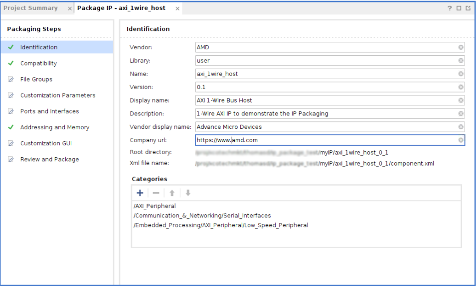

2. Compatibility:  
As the section name indicates, specify the device families compatible with your IP.
    + Package for Vitis: Leave unchecked. If you wanted to package the IP for use with Vitis, you would check the box and select the Control protocol.
    + Package for IPI: Leave checked because want to use the IP with the Vivado IP integrator.
        + Ignore Freq_Hz: Leave unchecked.
    + Family: Add the device family compatible with your IP. You can manually select every family supported, or you can use regular expression. You can also select the Life cycle support. You also have the option to let the tool automatically figure out the family support. That is what you will do here for level beta.
    + Simulator: Enumerate the supported simulator, here we will keep the default value.
    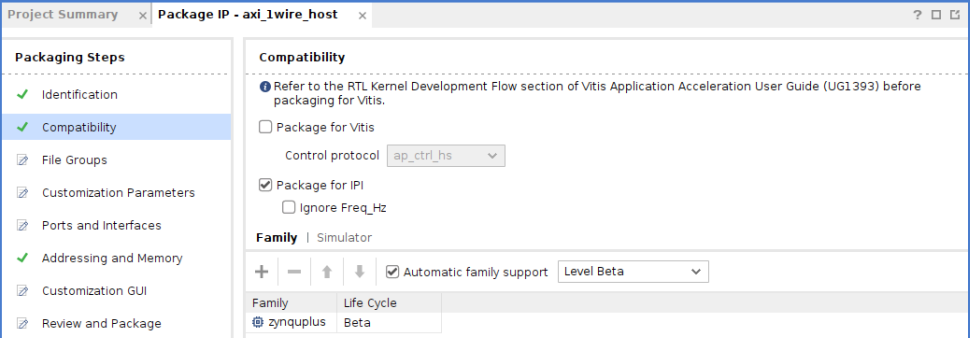

3. File Groups:  
This section is used to incorporate a large range of type of files to be deliver with your IP. The minimum requirement is to incorporate the RTL files of your IP. You have the option to incorporate way more than that, such as drivers file, constraints, simulation files, testbenches, example projects, user guides, and so on.
    1. Click **Merge changes from File Groups Wizard** to reflect the changes done previously when adding the HDL files. Expand all directory and see that the new files have been added.
        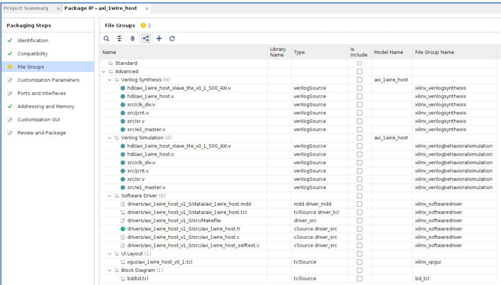
    2. Edit the drivers file. As you can see, the IP packager already created the baremetal drivers under Software Driver.
        1. Edit the Makefile to match *<working_directory>/reference_files/baremetal_driver/src/Makefile*. These changes are required for Vitis to properly use the drivers.
        2. Edit the Self Test driver file *axi_1wire_host_selftest.c" to match. *<working_directory>/reference_files/baremetal_driver/src/axi_1wire_host_selftest.c*
            + Here you are doing a simple test to read the IP ID and version stored in the AXI registers. This does not ensure that the IP is functioning properly in the design, but it ensures that it is present and that the right version for the drivers have been loaded.
        3. Edit the driver header file *axi_1wire_host.h* to match *<working_directory>/reference_files/baremetal_driver/src/axi_1wire_host.h*
            + The registers offset are defined here:

                ```h
                #define AXI_1WIRE_HOST_INSTR_REG_OFFSET 0x0
                #define AXI_1WIRE_HOST_CTRL_REG_OFFSET 0x4
                #define AXI_1WIRE_HOST_IRQCTRL_REG_OFFSET 0x8
                #define AXI_1WIRE_HOST_STAT_REG_OFFSET 0xC
                #define AXI_1WIRE_HOST_RXDATA_REG_OFFSET 0x10
                #define AXI_1WIRE_HOST_GPIODATA_REG_OFFSET 0x14
                #define AXI_1WIRE_HOST_IPVER_REG_OFFSET 0x18
                #define AXI_1WIRE_HOST_IPID_REG_OFFSET 0x1C
                ```

            + The 1-Wire core instruction are also defined in the header file:

                ```h
                #define AXI_1WIRE_HOST_INITPRES	0x0800
                #define AXI_1WIRE_HOST_READBIT	0x0C00
                #define AXI_1WIRE_HOST_WRITEBIT	0x0E00
                #define AXI_1WIRE_HOST_READBYTE	0x0D00
                #define AXI_1WIRE_HOST_WRITEBYTE	0x0F00
                #define AXI_1WIRE_HOST_RESET    0x80000000
                ```

            + General read and write to the AXI IP are defined in the header file; this is automatically added when creating the IP.

                ```h
                #define AXI_1WIRE_HOST_mWriteReg(BaseAddress, RegOffset, Data) \
  	                Xil_Out32((BaseAddress) + (RegOffset), (u32)(Data))
                #define AXI_1WIRE_HOST_mReadReg(BaseAddress, RegOffset) \
                    Xil_In32((BaseAddress) + (RegOffset))
                ```

            + The rest of the file define the driver function; you are can review them.
        4. Edit the driver source file *axi_1wire_host.c* to match *<working_directory>/reference_files/baremetal_driver/src/axi_1wire_host.c*.
        This is where you implement your driver functions.
        5. Open *axi_1wire_host.tcl* and *axi_1wire_host.mdd*. No changes are required for the 1-Wire IP.
        6. Import the YAML file for the drivers to be compatible with the new Vitis IDE:
            1. Using the Tcl console, copy the YAML file to the IP driver folder:

                ```
                cp 
                <working_directory>/reference_files/baremetal_driver/data/axi_1wire_host.yaml <working_directory>/myIP/axi_1wire_host_0_1/drivers/axi_1wire_host_v1_0/data/
                ```

            2. Right-click **Software Driver** and select **Add Files...**.
            3. Click **Add Files**.
            4. Select **<working_directory>/myIP/axi_1wire_host_0_1/drivers/axi_1wire_host_v1_0/data/axi_1wire_host.yaml**.
            5. Leave **Scan and add RTL include files into project** and **Copy sources into IP Directory** unchecked.
        7. Import the CMakeLists file for the drivers to be compatible with the new Vitis IDE:
            1. Using the TCL console, copy the CMakeLists file to the IP driver folder:

                ```
                cp <working_directory>/reference_files/baremetal_driver/src/CMakeLists.txt <working_directory>/myIP/axi_1wire_host_0_1/drivers/axi_1wire_host_v1_0/src/
                ```

            2. Right-click **Software Driver**, and select **Add Files...**.
            3. Click **Add Files**.
            4. Select **<working_directory>/myIP/axi_1wire_host_0_1/drivers/axi_1wire_host_v1_0/src/CMakeLists.txt**.
            5. Leave **Scan and add RTL include files into project* and *Copy sources into IP Directory** unchecked.
    3. Add the constraint to the package.

        1. In the sources window, click **Add Sources** . Select **Add or create constraints**, and click **Next >**.
        2. Select **Add Files**, and then select **<working_directory>/reference_files/constraints/axi_1wore_host.xdc**. Select **Copy sources into IP Directory**, and click **Finish**.
        3. Click **Merge changes from File Groups Wizard** again, and observe that the constraint file now appear under *Advanced/Verilog Synthesis*.
        4. The constraints file should not be classified as *Verilog Synthesis*. In the *Source* window, right-click **Constraints &rarr; contrs_1 &rarr; axi_1wire_host.xdc**, select **Set Used In...**, and then deselect **Synthesis**.
        5. Click **Merge changes from File Groups Wizard** again. Observe that a new file group *Implementation* has been created and that the XDC file was moved there.
        6. Click the file to edit the IP File Properties, and change the processing order to *late*.

            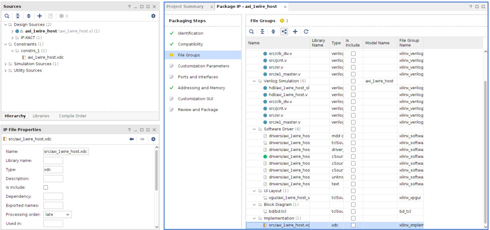

            Open the constraint file and review it. You have two *create_generated_clock* constraints to let the tool know the frequency of the clocks generated within the IP and one constraint *set_clock_groups* to let the tool know that the second clock is physically exclusive to the input clock.
    4. Add simulation file to the IP package.  
        You can also add simulation only files to the packaged IP such as a responder model of the external interface or any other content required to simulate and validate your IP.  
        Given the complexity of emulating an external 1-Wire device, no responder models are provided for the 1-Wire Host design. The core has been verified through limited simulation before being packed in an AXI IP by using a specific known sequence of a DS18B20 device.  
        If you want to add simulation files to your packaged IP, you can do the following:
        1. In the File Groups window, right-click **Verilog Simulation**.
        2. Select **Add Files...**.
        3. Add the files, and select **Copy sources into IP Directory**.

4. Customization Parameters:  
This section is used to provide information about the IP customizable parameter. By default, the AXI parameters are displayed and are non-editable. You can choose to display your custom parameters, and you have the option to allow the user to modify their values.
    1. Click **Merge changes from Customization Parameters Wizard** to reflect the changes done previously.
    2. A new parameter has been added under *Hidden Parameters*; it is the clock divider value that was added when editing the AXI wrapper.
    3. Click the parameter, and in the IP Parameter Properties window, add the following description: *S00_AXI_CLK divider to reach 1MHz target frequency*.
    4. Right-click and select **Edit Parameter...**.
        1. Select **Visible in Customization GUI**.
        2. Change the display name to *S00 AXI CLK DIVIDER*. This better reflects the purpose of the parameter, which is to reduce the input AXI clock frequency.
        3. Add the following tooltip: *S00_AXI_CLK divider value to produce a 1MHz clock (e.g. for a 100MHz S00_AXI_CLK, the divider would be 100)*.
        4. Select **Specify Range**.
        5. For Type, select **Range of integers**.
        6. Input 1 as the minimum and 255 as the maximum.
        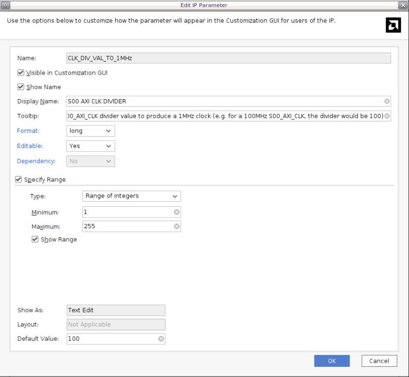

5. Ports and Interfaces:  
This section is used to provide some information about the IP ports and interfaces. By default, the AXI interfaces are prepopulated with the required value for the AXI protocol based on the information provided when creating the IP. Here you only have one AXI interface, *S00_AXI*. If you were to expand it, you will see all the signals and data ports. The clock and reset signal associated with the AXI interface can be found under the *Clock and Reset Signals* interface group.
    1. Click **Merge changes from Customization Parameters Wizard** to reflect the changes done previously.
    2. The Vivado IP packaging tool automatically recognized your interupt signal and created the *w1_irq* interface. You can right-click it to edit the interface. You can also expand it and right-click the interrup signal to edit the port. Here you will keep the default value.
    3. The *w1_bus* signal is not part of an interface, so it can stay as it is. If your IP ports were part of a common interface, you can add the interface and associate your ports to it for enhance usability.
        > **NOTE**: You might be getting a warning *Clock Interface 'S00_AXI_CLK' has no FREQ_HZ parameter*. If your IP required a specific clock frequency for the AXI interface, right-click  the AXI clock interface (*Clock and Reset Signals &rarr; S00_AXI_CLK*), select *Edit Interface...*. Then go to *Parameters*, add *Requires User Setting &rarr; FREQ_HZ*, and then specify its value under *User Set*. Here your IP supports any frequency higher than 1 MHz, so you can safely ignore the warning.
    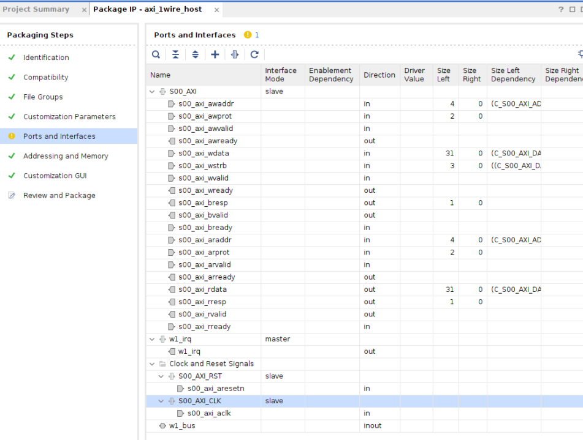

6. Addressing and Memory:  
This section is used to define memory-map and address space in the IP. The tool automatically infers the AXI interface address map. If you have a custom address space not populated by the tool, right-click and launch the *IP Addressing and Memory Wizard*. Here you do not have any modifications to do.
    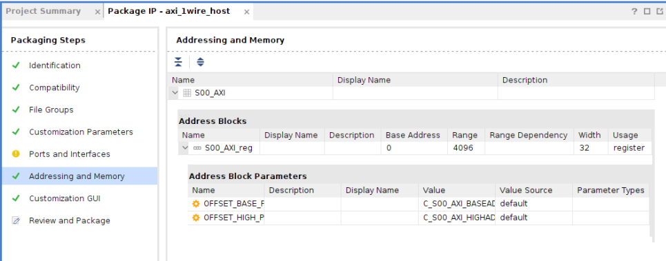

7. Customization GUI:  
This section is used to customize the IP GUI that is used to instansiate the IP in the IP Integrator flow. You can create multiple pages and decide which parameters are shown and which are hidden. You can also decide to have parameters display on each page. Here you will keep the default layout. S00 AXI CLK DIVIDER would appear on every pages if you have more than one. The AXI parameters would only appear on page 0.
    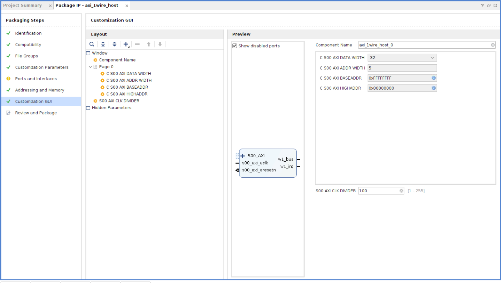

8. Review and Package:  
    This last section is used to merge all your changes in a packaged IP. You also see a summary of the basic information about your IP and where it is located. Every time you repackage the IP, it will increase the revision number, not the major and minor version. To increate the version, you need to go back to the *Identification* section. Once you packaged your IP, you can always come back to the *<working_directory>/myIP/edit_axi_1wire_host_v0_1.xpr* project to re-edit your IP and make any changes needed.

    Even if the core was properly tested, you might encounter an issue once it has been packaged. You might not know before testing the packaged IP what constraints are needed, so you can always package your IP, incorporate it in a design, figure out the constraints, come back here, and add them to the package. The same goes for any HDL and driver files and anything else.

    1. Click **IP has been modified** to ensure the tool incorporates any changes in the package.
    2. Click **Edit packaging settings**.
        1. Under *Automatic Behavior &rarr; After Packaging*, select **Create archive of IP**. This simplifies sharing of the IP and can be used to archive different versions of the IP.
        2. Under *Automatic Behavior &rarr; Edit IP in IP Packager*, deselect **Delete project after packaging**. This is useful if you want to come back and do some testing or modification in the project.
    3. Click **Package IP**. Your IP has now been packaged successfully. You can close the project or keep it open if you want to keep working on it. Here  close the project because you are working with an existing IP core.

For more information on the AMD Vivado™ IP packager, refer to the *Vivado Design Suite User Guide: Creating and Packaging Custom IP* [(UG1118)](https://docs.amd.com/r/en-US/ug1118-vivado-creating-packaging-custom-ip).  

For information about the other options to create and package custom IPs, refer to the *Vivado Design Suite Tutorial: Creating and Packaging Custom IP* [(UG1119)](https://docs.amd.com/r/en-US/ug1119-vivado-creating-packaging-ip-tutorial).

## Encrypting Your IP

The Vivado Design Suite support encryption up to the generation of the bitstream. You can encrypt different levels of the process, and you can encrypt the HDL files and/or the design checkpoints. For this tutorial, you will only look at the encryption of the HDL files. Encrypting your IP ensures that your property is protected and cannot be replicated.

Three files provided in this tutorial are encrypted (`<working_directory>/reference_files/hdl/clk_div.v`, `<working_directory>/reference_files/hdl/jcnt.v`, and `<working_directory>/reference_files/hdl/sr.v`). Any HDL files can be encrypted but be advised that the rights you assigned to your files affect how Vivado treats your IP.

You can use your own encryption key file or use the public one provided with the Vivado tool located at `<Install_Dir>/Vivado/<version>/data/pubkey`. If you do not specify the encryption key file, the tool will assume that the encryption key is located in the design source file. Be careful to specify a new file extension, otherwise you will overwrite the original one.
Generally, you will use the following Tcl command to encrypt a file:

```tcl
encrypt -key <keyfile> -ext <new_extension> -lang <verilog> myFile.v
```

+ `&lt;keyfile&gt;`: The keyfile with the encryption key. If you omit the `-key &lt;keyfile&gt;`, the tool will look for the key inside the design source file.
+ `<new_extension>`: Your new extension. Do not forget to include the dot (e.g: *.vp*). If you do not include `-ext <new_extension>`, the original file will be overwriten.
+ *&lt;verilog&gt;*: Specify your design file HDL. You can use *VHDL* or *verilog*.

For more information about encrypting IPs, consult the [Encrypting IP in Vivado section](https://docs.amd.com/r/en-US/ug1118-vivado-creating-packaging-custom-ip/Encrypting-IP-in-Vivado).
<p align="center"><b>Next step: <a href="./2_baremetal_driver.md"> Baremetal Driver Development</a></b></p>

---
<p class="sphinxhide" align="center"><sub>Copyright © 2024-2025 Advanced Micro Devices, Inc.</sub></p>
<p class="sphinxhide" align="center"><sup><a href="https://www.amd.com/en/corporate/copyright">Terms and Conditions</a></sup></p>