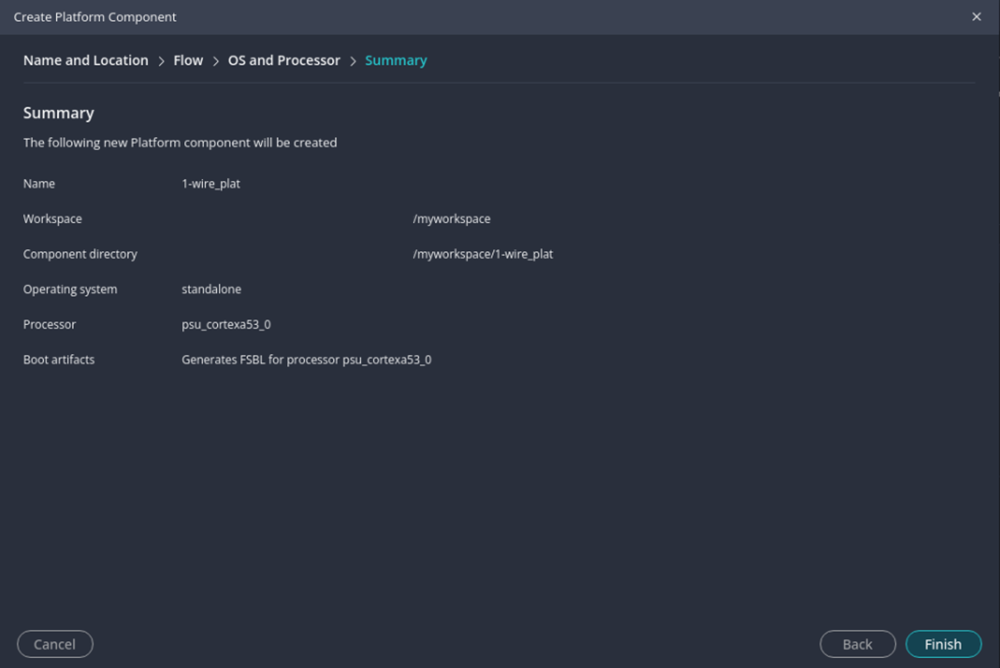

<table class="sphinxhide" width="100%">
 <tr width="100%">
    <td align="center"><h1>Wrapping your Custom IP with AXI Packaging and Linux Driver Tutorial</h1>
    </td>
 </tr>
</table>

# Baremetal Driver Development

In this section of the tutorial, you cover the process of writing baremetal (standalone) drivers for the 1-Wire core IP. The process targets the 1-Wire core IP, and it is difficult to give an example that would be applicable to all kind of IPs as drivers are specific to the IP. That being said, the high level process should be applicable to most IPs.

## Outline

1. [Introduction](#introduction)
2. [The 1-Wire Core Baremetal Drivers Development](#the-1-wire-core-baremetal-drivers-development)
   1. [Creating a Bitstream and a Vitis Project](#creating-a-bitstream-and-a-vitis-project)
   2. [Test the IP Using XSCT](#test-the-ip-using-xsct)
   3. [Developing Drivers with Vitis](#developing-drivers-with-vitis)
   4. [Test a Baremetal Application](#test-a-baremetal-application)

## Introduction

A baremetal driver is a low-level software component designed to interface directly with the hardware of a microcontroller or system-on-chip (SoC) without the need for an operating system. It serves as an essential tool for developers working on embedded systems, providing a means to manipulate hardware devices, access registers, and perform other significant operations that would be otherwise unattainable through high-level software abstraction layers. This type of driver is particularly useful when testing and debugging complex intellectual properties (IPs) that can be difficult to validate using simulation alone.

The primary purpose of a baremetal driver is to offer an efficient and streamlined way for engineers to control and test the hardware in real-world situations. By removing the overhead associated with operating systems, developers have more direct access to the underlying hardware and therefore can achieve greater flexibility, faster prototyping, and more in-depth insights into the system's behavior. This ultimately leads to a quicker development cycle and the ability to quickly identify and resolve system issues.

Before transitioning to a Linux-based development environment, it is crucial to validate a design using baremetal drivers. This step provides engineers with the opportunity to verify the fundamental functionality of hardware components in their embedded systems without the complexity of a full operating system. By ensuring that all hardware elements and subsystems work as expected in a baremetal environment, potential issues can be detected and addressed early in the development process, thereby reducing integration challenges when later incorporating the hardware into a more comprehensive Linux-based framework.

In a Linux development environment, interacting with the hardware is typically facilitated through kernel drivers that can mask or obscure certain low-level interactions. However, by first testing the design using baremetal drivers, engineers can make sure that any issues they encounter are hardware-related and not caused by the additional software layers present in a full operating system. This thorough validation of the hardware paves the way for a smoother transition to a Linux-based architecture, ensuring a solid foundation for building more complex applications with confidence.

By providing baremetal drivers packed with your IP, you enable your customers to validate their design or even develop their application faster using the AMD Vitis&trade; Unified Software Platform. These drivers not only facilitate seamless integration of your IP into the customers' systems but also simplify the development and debugging processes for both hardware and software components. This ultimately leads to more rapid prototyping, reduced time-to-market, and an overall enhanced experience for the end-user.

The Vitis Unified Software Platform is designed specifically to provide developers with an all-inclusive environment for crafting applications that leverage the full potential of AMD's hardware capabilities. By incorporating baremetal drivers into the IP package, your customers are equipped with everything they need to optimize performance, address any compatibility concerns, and ensure a smooth experience as they deploy their application on AMD-based platforms.

## The 1-Wire Core Baremetal Drivers Development

The process of developing IP drivers is closely related to the nature of the IP. The 1-Wire core IP is a simple controller that executes a few specific sets of instructions to implement the 1-Wire protocol. Each instructions has specific known expected values in the Status signal register. For this reason, writing the drivers for the 1-Wire bus master signals is not too difficult and will help in debugging the IP itself. The 1-Wire bus master signals supported are:

+ Reset/Presence signal
+ Write bit (0 or 1) signal
+ Read bit (0 or 1) signal.

The sequence is always:

1. Wait for the `READY` signal from the IP status register.
2. Write the instruction in the instruction register.
3. Write the `GO` signal, and clear the _CONTROL RESET_ signal in the control register.
4. Wait for the `DONE` signal from the IP status register.
5. Retrieve data if needed.
6. Clear the `GO` signal in the control register.

For more information about the 1-Wire Core IP, review its documentation here: [AXI 1-Wire Host](https://github.com/Xilinx/axi_1wire_host-design/blob/main/README.md).

Now you will go through the process of creating the hardware design to integrate the 1-Wire core you packaged previously, generate the bitstream, and create a Vitis project to develop and test the baremetal driver. You will also get some insight on how to debug the IP core.

### Creating a Bitstream and a Vitis Project

1. Create the hardware design.

   1. Create a new Vivado project or use the one previously created. You will use the later one, that is, `<working_directory>/myproject/myproject.xpr`.
   2. Create a new block design, and name it `mydesign`.
   3. In the block diagram, click **Add IP** , search for "1wire", and select **AXI 1-Wire Bus Host**.
   4. Again click the **Add IP** , search for "MPSoC", and select **Zynq UltraScale+ MPSoC**.
   5. Click **Run Block Automation** and **Apply Board Preset**.
   6. Click **Run Connection Automation**, and keep the default value that will connect the AXI slave port of the 1-Wire core to the Zynq UltraScale+ MPSoC AXI master HPM0 port.
   7. Click **Run Connection Automation** again.
   8. Right-click the _w1_bus_ port of the AXI 1-Wire Bus Host, and select **Make External**.
   9. Connect the _w1_irq_ port of the AXI 1-Wire Bus Host to the `pl_ps_irq` port of the Zynq UltraScale+ MPSoC.

   > **NOTE:** By default, the _pl_clk0_ clock of the Zynq UltraScale+ MPSoC is 99.999 MHz, so the default clock divider parameter of the 1-Wire core (100) does not need to be modified. If you are using a different clock, modify the value of the clock divider. To do so, double-click the 1-Wire core to edit it.

2. Generate the bitstream.

   1. In the source window, right-click **Design Sources &rarr; mydesign.bd**,and click **Create HDL Wrapper...**. Select **Let Vivado manage wrapper and auto-update**.
   2. In the source window, right-click **Design Sources &rarr; mydesign_wrapper.v**, and click  **Set as Top**.
   3. In the source window, click **Add Sources** .
      1. Select **Add or create constraints**, and click **Next >**.
      2. Select **Create File**, create a new constraint file, and name it `myConstraint`.
      3. Click Finish.
   4. Edit the constraint file, and add the following for the KD240.

      ```verilog
      set_property PACKAGE_PIN H13 [get_ports w1_bus_0]
      set_property IOSTANDARD LVCMOS33 [get_ports w1_bus_0]
      set_property PULLUP true [get_ports w1_bus_0]
      ```

   5. Click **Generate Bitstream**.
   6. You can open the implemented design and look at it.
   7. Click **File &rarr; Export &rarr; Export Hardware...**
      1. Click **Next >** on the first page of the new window.
      2. Select **Include bitstream**, and click **Next >**.
      3. Take note of the file name and where it is located; it should be `<working_directory>/myproject/mydesign_wrapper.xsa`, and click **Finish**.

3. Create a Vitis platform.

   1. Source the Vitis installation, usually using a command similar to ```source /opt/Xilinx/Vitis/2024.2/settings64.sh```. Then, launch the Vitis IDE by entering ```vitis```.
   2. In the Vitis Unified IDE, select **Set Workspace**. Create a new workspace `<working_directory>/myworkspace/`, navigate to the newly create workspace directory, and click **Open**.
   3. Under Embedded Development, click **Create Platform Component**.
      1. Name and Location:
         + Component name: _1-wire_plat_
         + Component location: _<working_directory>/myworkspace/_ (default location)
      2. Flow:
         + Select **Hardware Design**.
         + Select your hardware design (XSA) file by clicking **Browse**, and select **`<working_directory>/myproject/mydesign_wrapper.xsa`**.
      3. OS and Processor:
         + Operating system: _standalone_
         + Processor: _psu_cortexa53_0_
         + Keep **Generate Boot artifacts** selected.
         + Select **Generate PMU Firmware**.
         + Target processor to create FSBL: Select _psu_cortexa53_0_.
         
   4. (Optional) Modify the STDIN and STDOUT for KD240. For other platforms, you might not need to do this step. This step is needed for KD240 to display output on the UART.
      1. Under MYWORKSPACE, open _1-wire_plat &rarr; Settings &rarr; vitis-comp.json_.
      2. Navigate to _1-wire_plat &rarr; psu_cortexa53_0 &rarr; standalone_psu_cortexa53_0 &rarr; Board Support Package &rarr; standalone_.
      3. Modify the configuration as follows:
         + standalone_stdin: `psu_uart_1`
         + standalone_stdout: `psu_uart_1`
      4. Navigate to _1-wire_plat &rarr; psu_cortexa53_0 &rarr; zynqmp_fsbl &rarr; Board Support Package &rarr; standalone_.
      5. Modify the configuration as follows:
         + standalone_stdin: `psu_uart_1`
         + standalone_stdout: `psu_uart_1`
      6. Navigate to _1-wire_plat &rarr; psu_pmu_0 &rarr; zynqmp_pmufw &rarr; Board Support Package &rarr; standalone_.
      7. Modify the configuration as follows:
         + standalone_stdin: `psu_uart_1`
         + standalone_stdout: `psu_uart_1`
   5. Build the platform.
      1. In the _Flow_ window, select the *1-wire_plat* component, and click **Build**.

### Test the IP Using XSCT

As mentioned in the first part of this tutorial, simulating the 1-Wire core is difficult because of the complexity of simulating the 1-Wire protocol and the AXI protocol simultaneously. You will now test the IP by reading and writing directly to the AXI registers. This way you do not have to think about the AXI transactions.

1. Connect everything to the KD240:
   + Connect the USB Micro-B cable from your computer to the JTAG/UART of the KD240.
   + Connect a 1-Wire device to the KD240. Here you will be using a DS18b20 temperature sensor.
   + Optional: Connect an oscilloscope to the 1-Wire device data wire to view the signal for further debugging.
   + Connect the power supply to the KD240.
2. Launch Xilinx Software Command Tool (XSCT) and program the board:
   1. Source the Vitis installation, usually using a command similar to ```source /opt/Xilinx/Vitis/2024.2/settings64.sh```. Then, launch the XSCT by entering ```xsct```.
   2. Connect to the KD240 by entering ```connect``` in the xsct console.
   3. Change the boot mode to JTAG by entering the following:  

      ```bash
      targets -set -filter {name =~ "PSU"}
      mwr 0xffca0010 0x0
      mwr 0xff5e0200 0x0100
      rst -system
      ```

   4. Program the bitstream to the KD240:

      ```bash
      targets -set -filter {name =~ "PSU"}
      fpga <working_directory>/myworkspace/1-wire_plat/export/1-wire_plat/hw/sdt/mydesign_wrapper.bit
      mwr 0xffca0038 0x1FF
      ```

   5. Program the PMU:

      ```bash
      targets -set -filter {name =~ "MicroBlaze PMU"}
      dow <working_directory>/myworkspace/1-wire_plat/export/1-wire_plat/sw/boot/pmufw.elf
      con
      ```

   6. Program the FSBL:

      ```bash
      targets -set -filter {name =~ "Cortex-A53 #0"}
      rst -processor -clear-registers
      dow <working_directory>/myworkspace/1-wire_plat/export/1-wire_plat/sw/boot/fsbl.elf
      con
      after 10000
      stop
      ```

3. Test the IP:
   1. Read the registers to make sure the device is properly programmed:
      > **NOTE:** You can go back to the Vivado project to find the base address of the 1-Wire AXI IP. For you, it is _0xA0000000_.

      ```bash
      mrd -force 0xA0000018
         0x76000001
      mrd -force 0xA000001C
         0x10EE4453
      ```

   2. Execute the initialization sequence:

      ```bash
      # Reset the 1-Wire IP
      mwr -force 0xA0000004 0x80000000
      # Read the signal register
      mrd -force 0xA000000C
         # 0x00000010 indicate the IP is in the ready state
      # Write the initialization command
      mwr -force 0xA0000000 0x00000800
      # Write the Go signal
      mwr -force 0xA0000004 0x00000001
      # Read the signal register
      mrd -force 0xA000000C
         # 0x00000001 indicate that the IP is done and no error were detected
      ```

      No error detected with the done signal indicates that there were no presence failures so that the IP has detected a device on the bus. You can continue to manually test the IP, but the tutorial stops here.  

      When you are debugging your own IP, you can use an oscilloscope, add integrated logic analyzers (ILAs), or any other tool to monitor the signals in your design and see what is not behaving as expected. It is highly recommended to start debugging your core as soon as possible in the design process, even before packaging it.

### Developing Drivers with Vitis

Here you cheated by integrating the drivers in the packed IP before doing any testing and any development. Because you are starting with an IP that you know is functional and with existing drivers, you were able to package everything from the beginning. Realistically, you would probably have to do a few iterations before getting the final result. For the next steps, continue as if you did not have existing drivers packaged with the IP.

1. Go back to your Vitis workspace, and explore the platform.
   + Look at the `xparameters.h` file under _1-wire_plat &rarr; Output &rarr; 1-wire_plat &rarr; sw &rarr; standalone_psu_cortexa53_0 &rarr; include_.  

      The `xparameter.h` file in Vitis is a header file that contains definitions of various hardware-related parameters, such as base addresses, interrupt IDs, and device IDs, which are generated by the AMD tools during the compilation process. This file enables easy access and configuration of the devices and peripherals in the embedded system.  

      If you search for `1wire`, you can find the parameters for the base address of the 1-Wire IP.
   + Look under _1-wire_plat &rarr; Output &rarr; 1-wire_plat &rarr; hw &rarr; sdt &rarr; drivers &rarr; axi_1wire_host_v1_0_.  
   You can find the 1-Wire drivers you packaged in the IP.
2. Create a Hello World application.  

   The first step is to create a Hello World application, and run it on the target to ensure that your UART and your platform is correctly configured.
   1. Go back to the Welcome tab, and click **Examples**.
   2. In the Examples tab, select **Hello World** under **Embedded Software Examples**.
   3. From the Hello World tab, click **Create Application Component from Template**.
   4. Create the application:
      1. Name and Location:
         + Component name: `hello_world`
         + Component location: `<working_directory>/myworkspace`
      2. Hardware:
         + Select the **1-wire_plat** platform.
      3. Domain:
         + Select the **standalone_psu_cortexa53_0** domain.
   5. Build the Hello World application:
      + Click **Build** under **Flow**, and make sure **hello_world** is the selected component.
   6. Run the application
      1. Redo the steps previously done in XSCT to configure the bootmode to JTAG, to program the bitstream, the PMU, and FSBL.
      2. Load the application program:

         ```bash
         dow <working_directory/myworkspace/hello_world/build/hello_world.elf>
         con
         ```

         You should the _Successfully ran Hello World application_ message on the serial terminal.
3. Create and develop the drivers.

   Using an application to develop the drivers simplifies the process as you can directly make the changes here instead of having to repack the IP, regenerate the bitstream, and rebuild the platform. Here you work at the application level. In the baremetal world, there is not really a difference between the application level and the platform level which is not the case in the Linux world. That is why it is always recommended to start developing drivers in the baremetal world as you do not have to take into account the different layers that exist in Linux.  

   Here you start with the Hello World application and add driver functions.  
   Two functions are defined in the Vivado IP Packager automatically generated header file. These are used to read and write the 1-Wire IP registers:

      ```C
      #define AXI_1WIRE_HOST_mWriteReg(BaseAddress, RegOffset, Data) \
         Xil_Out32((BaseAddress) + (RegOffset), (u32)(Data))
      #define AXI_1WIRE_HOST_mReadReg(BaseAddress, RegOffset) \
         Xil_In32((BaseAddress) + (RegOffset))
      ```

   1. Create the source and header driver files:
      1. Right-click **WorkSpace &rarr; hello_world &rarr; Sources &rarr; src**, and select **New File**.
      2. Name it `w1_driver_dev.c`.
         + Add the following include:

            ```C
               #include "axi_1wire_host.h"
               #include "w1_driver_dev.h
            ```

      3. Create a second one, and name it `w1_driver_dev.h`.
         + Add the following to the file:

            ```C
               #ifndef W1_DRIVER_DEV_H
               #define W1_DRIVER_DEV_H
               #include "xil_types.h"
               #include "xstatus.h"
               #endif
             ```

   2. Create a function to execute the initialization sequence:
      1. In `w1_driver_dev.h`, declare the initialization function before the ```#endif``` statement:

         ```C
         u8 w1_resetbus(u32 baseaddr);
         ```

      2. In `w1_driver_dev.c`, define the initialization function:

         ```C
         u8 w1_resetbus(u32 baseaddr) {
            u8 val = 0;

            /* Reset 1-wire Axi IP */
            AXI_1WIRE_HOST_mWriteReg(baseaddr, 0x4, 0x80000000);

            /* Wait for READY signal to be 1 to ensure 1-wire IP is ready */
            while((AXI_1WIRE_HOST_mReadReg(baseaddr, 0xC) & 0x00000010) == 0){}

            /* Write Initialization command in instruction register */
            AXI_1WIRE_HOST_mWriteReg(baseaddr, 0x0, 0x0800);

            /* Write Go signal and clear control reset signal in control register */
            AXI_1WIRE_HOST_mWriteReg(baseaddr, 0x4, 0x00000001);

            /* Wait for done signal to be 1 */
            while((AXI_1WIRE_HOST_mReadReg(baseaddr, 0xC) & 0x00000001) == 0){}

            /* Retrieve MSB bit in status register to get failure bit */
            if ((AXI_1WIRE_HOST_mReadReg(baseaddr, 0xC) & 0x80000000) != 0)
               val = 1;

            /* Clear Go signal in register 1 */
            AXI_1WIRE_HOST_mWriteReg(baseaddr, 0x4, 0x00000000);

            return val;
         }
         ```

         You are basically writing a function to execute what you did manually in XSCT.
      3. Test the initialization function:
         1. Include the driver test header file and the xparameter in the hello world file (`helloworld.c`).

            ```C
               #include "w1_driver_dev.h"
               #include "xparameter
            ```

         2. Call the initialization function from the hello world application:

            ```C
               w1_resetbus(XPAR_AXI_1WIRE_HOST_0_BASEADDR);
            ```

         3. Run the application
            1. Redo the steps previously done in XSCT to configure the bootmode to JTAG, to program the bitstream, the PMU, the FSBL, and the hello world application.
            2. Read the registers to ensure the expected values are there.

               ```bash
               mrd -force 0xA0000000
                  # 0x00000800
               mrd -force 0xA0000004
                  # 0x00000000
               mrd -force 0xA0000008
                  # 0x00000000
               mrd -force 0xA000000C
                  # 0x00000010
               mrd -force 0xA0000010
                  # 0x00000000
               mrd -force 0xA0000014
                  # 0x00000001
               mrd -force 0xA0000018
                  # 0x76000001
               mrd -force 0xA000001C
                  # 0x10EE4453
               ```

      4. Now that you tested and validated the function, you can add it to the driver you want to package with the IP.
   3. Repeat the same process for all functions you want to implement with your driver. Once you have integrated all your driver's functions in your IP, you can repackage it. Simply go to the _Review and Package_ tab, and click **Re-Package IP**.  
   You will have to update your Vivado project to reflect your changes and regenerate the bitstream. Once the bitstream has been generated, you can export the hardware update the Vitis platform.

### Test a Baremetal Application

You will be creating an application to monitor the temperature using the DS18b20 temperature sensor. As you have originally packaged the IP with the proper driver, you will use the same Vitis project you previously created.

1. Create an empty application.

   Go back to the Welcome tab in Vitis, under Embedded Development, select **Create Embedded Application...** and select **Create Empty Embedded Application**.
   1. Name and Location:
      + Component name: `1-wire_app`
      + Component location: `<working_directory>/myworkspace`
   2. Hardware: Select the **1-wire_plat** platform.
   3. Domain: Select the **standalone_psu_cortexa53_0** domain.
   4. Source Files: None to add yet.
2. Import sources into the application:
   1. Under _myworkspace_, right-click **1-wire_app/Sources/src**.
   2. Select **Import &rarr; Files...**
   3. Navigate to _<working_directory>/reference_files/application_, and select **application_bm.c** and **application_bm.h**.
   4. Review both files; as you can see the application made use of the driver's function developed and packaged in the IP to configure and read the temperature from the sensor.
3. Create a top level source file to launch the application:
   1. Under _myworkspace_, right-click **1-wire_app/Sources/src**.
   2. Select **New File**.
   3. Name it `main.c`.
   4. Add the following in `main.c`:

      ```C
      #include "application_bm.h"
      #include "axi_1wire_host.h"
      #include "xparameters.h"

      int main()
      {
         s8 t_high = 120;
         s8 t_low = -6;
         int resolution = 12;

         AXI_1WIRE_HOST_SelfTest(XPAR_AXI_1WIRE_HOST_0_BASEADDR);
         continuous_temperature_reading(t_high, t_low, resolution);
         return 0;
      }
      ```

4. Build the application:
   1. Under the _Flow_ window, make sure the _1-wire_app_ component is selected.
   2. Click **Build**, and make sure the application build without errors.
5. Run the application:
   1. Repeat the steps in XSCT to configure the bootmode to JTAG, to program the bitstream, the PMU, and the FSBL onto the board:

      ```bash
      # Change bootmode
      targets -set -filter {name =~ "PSU"}
      mwr 0xffca0010 0x0
      mwr 0xff5e0200 0x0100
      rst -system
      # Load the bitstream
      targets -set -filter {name =~ "PSU"}
      fpga <working_directory>/myworkspace/1-wire_plat/export/1-wire_plat/hw/sdt/mydesign_wrapper.bit
      mwr 0xffca0038 0x1FF
      # Program the PMU
      targets -set -filter {name =~ "MicroBlaze PMU"}
      dow <working_directory>/myworkspace/1-wire_plat/export/1-wire_plat/sw/boot/pmufw.elf
      con
      # Program the FSBL
      targets -set -filter {name =~ "Cortex-A53 #0"}
      rst -processor -clear-registers
      dow <working_directory>/myworkspace/1-wire_plat/export/1-wire_plat/sw/boot/fsbl.elf
      con
      stop
      ```

   2. Load the application:

      ```bash
      dow <working_directory>/myworkspace/1-wire_app/build/1-wire_app.elf
      con
      ```

   3. You should see, in the Serial console, something similar to this:

      ```
      ******************************
      * AXI 1-Wire Host Self Test
      * Reading IP ID and IP version
      * IP Subsystem vendor ID is 0x10EE
      * ID is 0x4453
      * IP version is 0.1
      ******************************

      Configuration done
      Temperature is: 19.3125
      ```

      Of course the temperature might be different for you.

   ---

   You now have an IP packaged with baremetal drivers that have been tested with an application to display the temperature. You did not incorporate an interrupt yet as they are difficult to handle in a baremetal platform and are tightly coupled to the processor used. Interrupts will be used in the next section as they are easily managed in Linux. It is far from impossible to incorporate interrupts in a baremetal system but this out of the scope of this tutorial.

   For more information on embedded designing with the Vitis Unified Software Platform, refer to the _Embedded Design Development Using Vitis User Guide_ [(UG1701)](https://docs.amd.com/r/en-US/ug1701-vitis-accelerated-embedded).  
   For more information on embedded software development using the Vitis Unified Software Platform, refer to the _Vitis Unified Software Platform Documentation: Embedded Software Development_ [(UG1400)](https://docs.amd.com/r/en-US/ug1400-vitis-embedded/Getting-Started-with-Vitis).  
   For more information on application acceleration development using the Vitis Unified Software Platform, refer to the _Vitis Unified Software Platform Documentation: Application Acceleration Development_ [(UG1393)](https://docs.amd.com/r/en-US/ug1393-vitis-application-acceleration).

<p align="center"><b>Next step: <a href="./3_linux_driver.md"> Linux Driver Development</a></b></p>

---
<p class="sphinxhide" align="center"><sub>Copyright © 2025 Advanced Micro Devices, Inc.</sub></p>
<p class="sphinxhide" align="center"><sup><a href="https://www.amd.com/en/corporate/copyright">Terms and Conditions</a></sup></p>